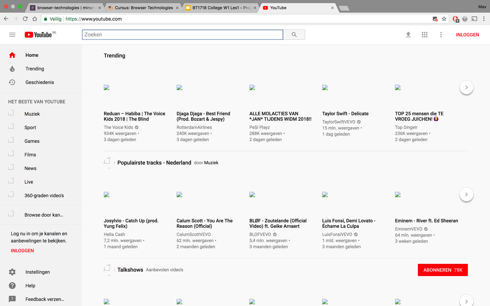
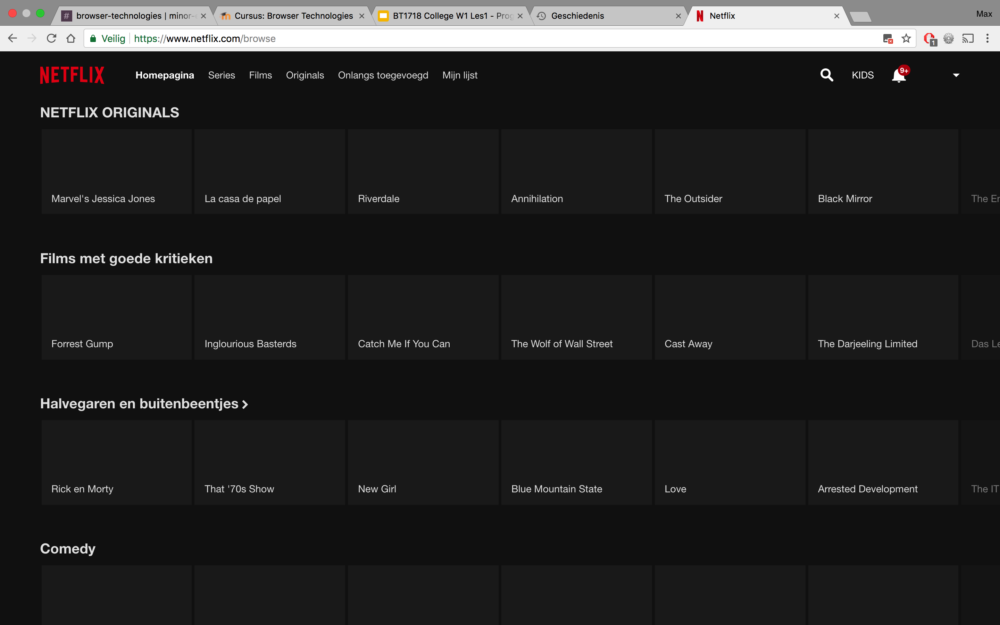
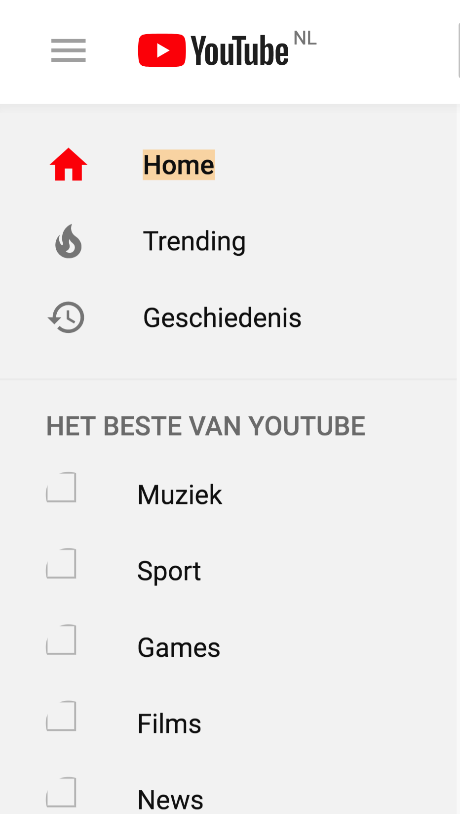
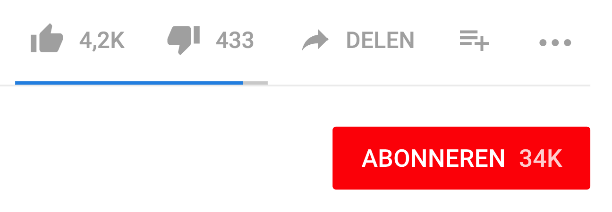
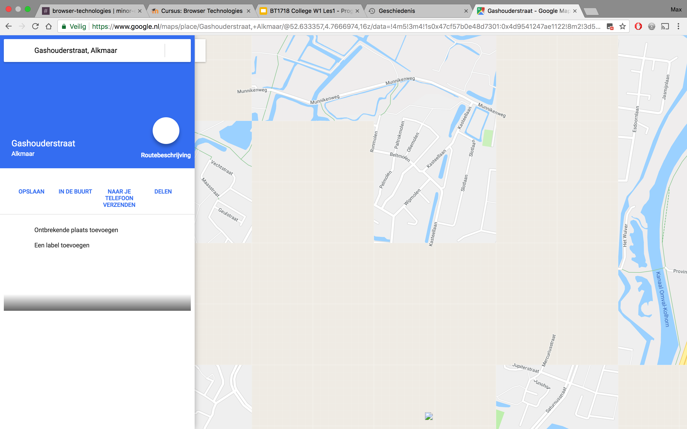
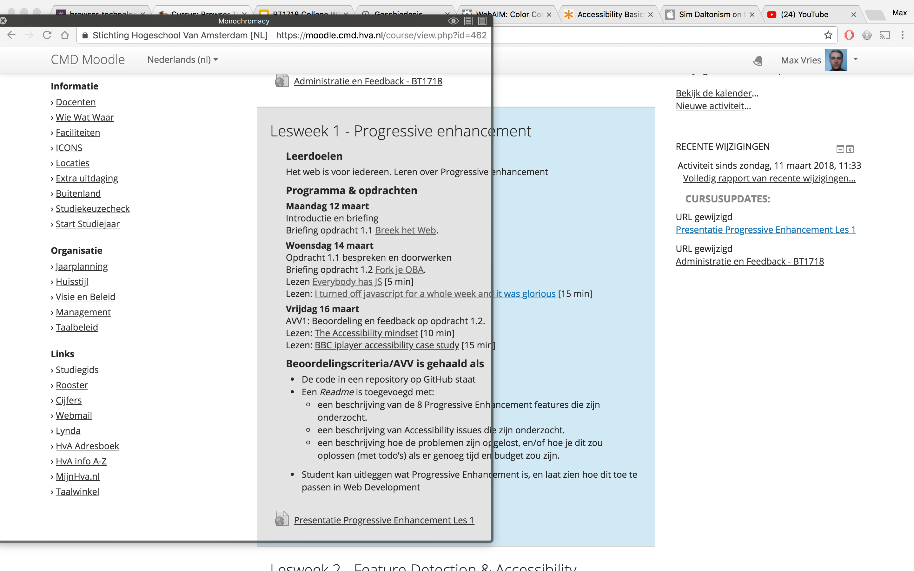
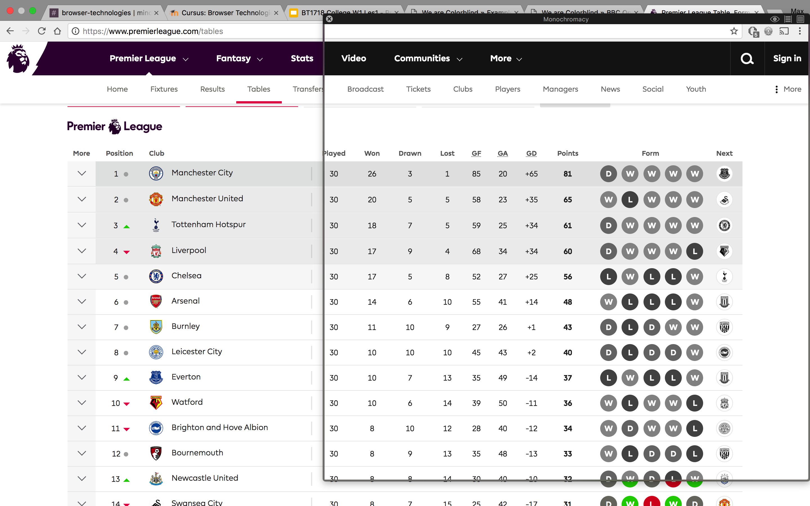
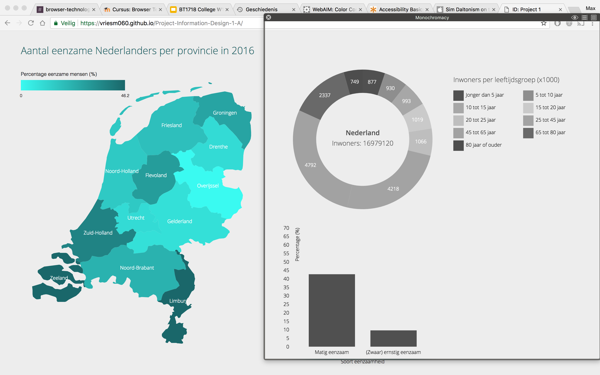

# Breek het Web

## Afbeeldingen

### Hoe kan je het testen?
---

Om te testen hoe een website er uit ziet met afbeeldingen uitgeschakeld, heb ik een Google Chrome extension gebruikt: Web Developer. Deze extension biedt een hoop developer tools waarmee je de browser kan beïnvloeden. Zo kan je onder andere afbeeldingen ‘uitzetten’. Dit heb ik gebruikt om te testen.

### Sites met problemen
---

Wanneer je afbeeldingen ‘uitzet’ op browsers, heb ik gemerkt dat er bij de meeste websites die ik gebruik niet veel verandert. Uiteraard kan je de afbeeldingen niet meer zien, wat de websites visueel minder aantrekkelijk maakt en het moeilijker maakt om te begrijpen waarvoor een afbeelding is bedoeld. Ik heb gemerkt dat het bijvoorbeeld moeilijker is om te weten waar een YouTube video of Netflix serie over gaat wanneer je geen thumbnail kan zien.

Maar ondanks dit zijn deze websites nog steeds goed te volgen aangezien er naast de afbeelding ook een titel staat die aangeeft waar de afbeelding voor staat en anders wordt dit aangegeven met de alt attribute die naar voren komt wanneer de afbeelding niet geladen wordt.

Wat me extra opviel bij YouTube was dat sommige iconen (en verrassend genoeg ook het logo) geen afbeeldingen waren, maar SVG elementen. Maar andere iconen waren wel afbeeldingen en dus niet zichtbaar. De iconen die voor belangrijke functies staan, zoals uploaden, like en delen zijn wel SVG, wat dus betekend dat je YouTube goed kan gebruiken zonder afbeeldingen.

Een website die het minder goed deed was tot mijn verbazing Google Maps. Met afbeeldingen uit werd de map nooit echt goed geladen. Dit verbaast me, aangezien ik had verwacht dat de map niet was opgebouwd uit afbeeldingen. Maar er gaat toch iets mis.

### Hoe kan je dit fixen?
---

Het eerste wat je kan doen om te voorkomen dat afbeeldingen noodzakelijk zijn voor je website, is om de alt atribute van een afbeelding in te vullen, zodat wanneer deze niet geladen wordt er via tekst alsnog verteld kan worden waar de afbeelding over gaat.

Voor vector afbeeldingen, zoals de meeste logo’s of iconen, kan je beter SVG gebruiken. Niet alleen zijn deze nog zichtbaar wanneer afbeeldingen uit staan, ook nemen deze minder geheugen in en zijn ze als vector opgebouwd, wat inhoudt dat de kwaliteit niet achteruit gaat bij grotere afbeeldingen.

## Kleur

### Hoe kan je het testen?
---

Ik heb de applicatie Sim Daltonism gebruikt om te kijken hoe de kleuren op websites er uit zien voor verschillende type kleurenblinden. Deze applicatie is een venster wat kleuren omzet om zo te simuleren hoe mensen met kleurenblindheid de website zouden zien.

### Sites met problemen
---

Iets wat mij direct opviel was de Moodle website, waar blauw gekleurde links op een blauw gekleurde achtergrond staan. Dit zorgt voor een laag contrast, waardoor de links minder opvallen dan dat links horen te doen.

Een ander goed voorbeeld zijn de groen en rode kleuren om aan te geven dat iets positief of negatief is, zoals in het voorbeeld van de voetbaluitslagen op de Premier League website, waarbij groen voor winst en rood voor verlies staat. Voor mensen met kleurenblindheid valt dit minder goed te zien. Nu wordt het in dit voorbeeld nog wel extra aangegeven met de W van win en L van lose.

Het beste voorbeeld is echter van mijn eigen werk. Voor het project Information Design heb ik een pie chart gemaakt die kleur gecodeerd is. Met dit filter zie je pas hoe slecht je de kleuren uit elkaar kan halen.

### Hoe kan je dit fixen?
---

Het eerste wat je kan doen om te voorkomen dat kleur niet goed overkomt, is door kleur niet het enige element te maken om iets mee te beschrijven. Wanneer je alleen rood gebruikt om iets negatief te laten maken, komt het niet altijd goed over. Je kan dit dan het beste combineren met tekst. Daarnaast is een goed contrast essentieel om te voorkomen dat elementen verdwijnen in de achtergrond, waardoor ze hun hiërarchie verliezen of zelfs niet meer te onderscheiden zijn van de achtergrond.
