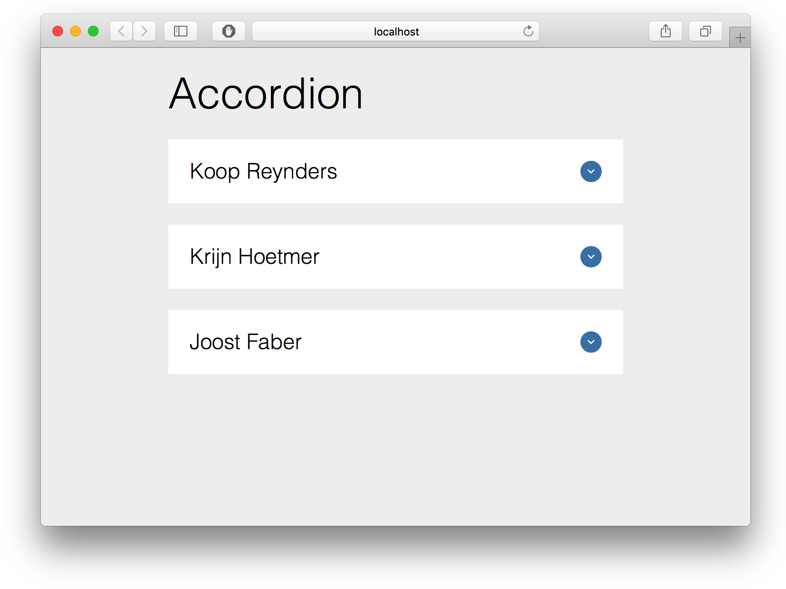
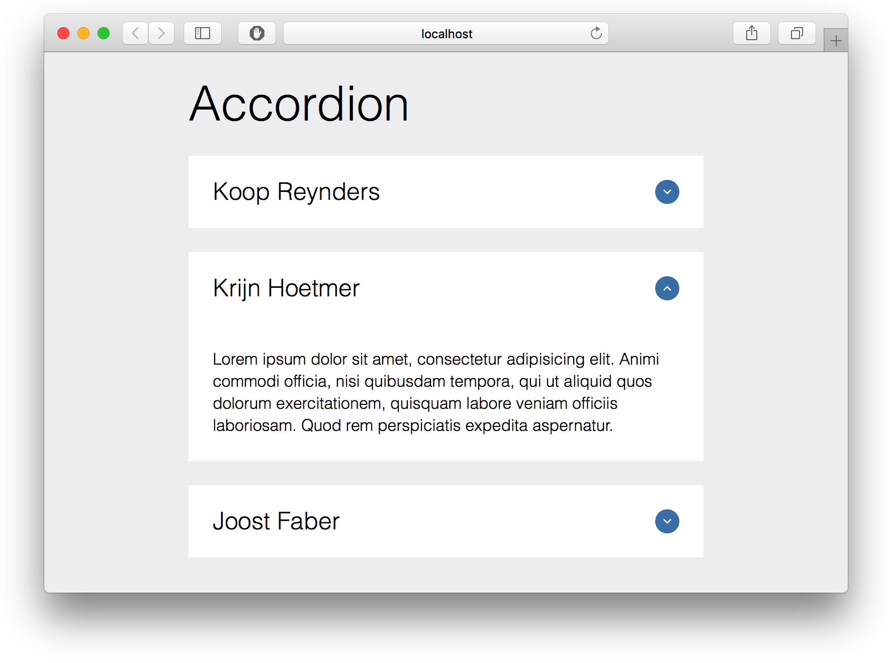

# Accordion



[Demo](https://vriesm060.github.io/browser-technologies/opdracht2/accordion/)

Een accordion, via Progressive Enhancement opgebouwt.

<!-- Brief description of the project. What is it about? -->

## Core functionaliteit

De core functionaliteit van de accordion is een overzicht geven van de belangrijkste informatie, om vervolgens via het principe van progressive disclosure details op te vragen wanneer er op een element geklikt wordt. Dan "klapt" het item open om meer informatie te geven.


*Core functionaliteit van een accordion*

Sinds HTML5 zijn er semantisch correcte elementen die voor deze functionaliteit zorgen. Dit zijn de `<details>` elementen, gecombineerd met de `<summary>` elementen en het `open` attribuut van `<details>`, wat er voor zorgt dat dit item al "opengeklapt" staat.

In de HTML ziet een accordion item er zo uit:

```
<details class="person">
  <summary class="summary">
    <h2>Koop Reynders</h2>
    <div class="details-marker" aria-label="details-marker">
      <svg viewBox="0 0 306 306">
        <polygon points="306,94.3 270.3,58.6 153,175.9 35.7,58.6 0,94.3 153,247.4"/>
      </svg>
    </div>
  </summary>
  <p>
    Lorem ipsum dolor sit amet, consectetur adipisicing elit. Animi commodi officia, nisi quibusdam tempora, qui ut aliquid quos dolorum exercitationem, quisquam labore veniam officiis laboriosam. Quod rem perspiciatis expedita aspernatur.
  </p>
</details>
```

Deze elementen zorgen al voor de gewenste functionaliteit. Ze worden echter niet door alle browsers ondersteund. Wanneer dit het geval is, moet deze functionaliteit gemaakt worden via Javascript. Het volgende stuk code kijkt of `<details>` ondersteund wordt. Is dat niet het geval, zorgt het zelf voor de functionaliteit:

```
if (document.createElement('details').open === undefined) {
  if (document.addEventListener) {
    var accordion = {
      summary: summary,
      init: function () {
        for (var i = 0; i < this.summary().length; i++) {
          this.summary()[i].nextElementSibling.className = 'close';
        }
      },
      openAccordion: function (summary) {
        summary.nextElementSibling.className = '';
      },
      closeAccordion: function (summary) {
        summary.nextElementSibling.className = 'close';
      }
    };

    accordion.init();

    for (var i = 0; i < accordion.summary().length; i++) {
      accordion.summary()[i].addEventListener('click', function () {
        if (this.nextElementSibling.className.indexOf('close') !== -1) {
          accordion.openAccordion(this);
        } else {
          accordion.closeAccordion(this);
        }
      }, false);
    }
  } else {
    for (var i = 0; i < summary().length; i++) {
      summary()[i].children[1].className += ' hidden';
    }
  }
}
```

Op deze manier doet de core functionaliteit het nagenoeg overal. Alleen browsers die `<details>` en `document.addEventListener` niet ondersteunen vallen terug op een lijst, in plaats van een accordion.

## Browser ondersteuning

#### Details en Summary elementen
---

 |  |  |  | 
--- | --- | --- | --- | --- |
12+ | 49+ | - | 15+ | 6+

Als het niet ondersteund wordt, wordt de functionaliteit gemaakt via Javascript. De styling wordt nog wel ondersteund. Bij IE 6-8 moet hier voor wel de elementen aangemaakt worden in een script in de `<head>`:

```
<script type="text/javascript">
  document.createElement('section');
  document.createElement('details');
  document.createElement('summary');
</script>
```

#### document.addEventListener
---

 |  |  |  | 
--- | --- | --- | --- | --- |
4+ | 2+ | 9+ | 10.1+ | 3.1+

Als dit niet wordt ondersteund valt de accordion terug tot een simpele lijst.

#### document.querySelectorAll
---

 |  |  |  | 
--- | --- | --- | --- | --- |
4+ | 3.5+ | 8+ | 10.1+ | 3.1+

Als dit niet wordt ondersteund wordt er bij elk DOM element gekeken of de specifieke class voorkomt. Zo ja, dan wordt deze in een array gezet.

```
var summary = function () {
  if (document.querySelectorAll('.summary') !== undefined) {
    return document.querySelectorAll('.summary');
  } else {
    var arr = [];
    var all = document.getElementsByTagName('*');
    for (var i = 0; i < all.length; i++) {
      if (all[i].className.indexOf('summary') !== -1) {
        arr.push(all[i]);
      }
    }
    return arr;
  }
}
```

#### CSS3 2D transforms
---

 |  |  |  | 
--- | --- | --- | --- | --- |
4+ | 3.5+ | 9+ | 11.5+ | 3.1+

Hier is geen fallback voor. Het is niet onderdeel van de core functionaliteit en daarom niet zo belangrijk om een fallback te hebben. Het wordt alleen gebruikt voor het pijltje dat aangeeft of het accordion item open of dicht staat.
