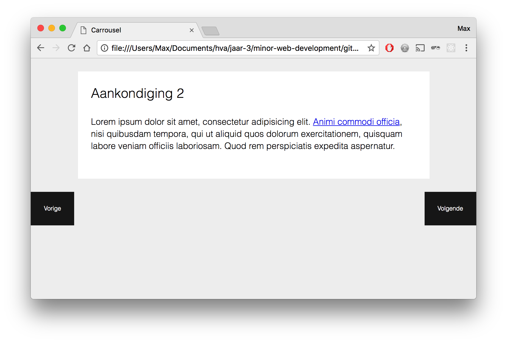
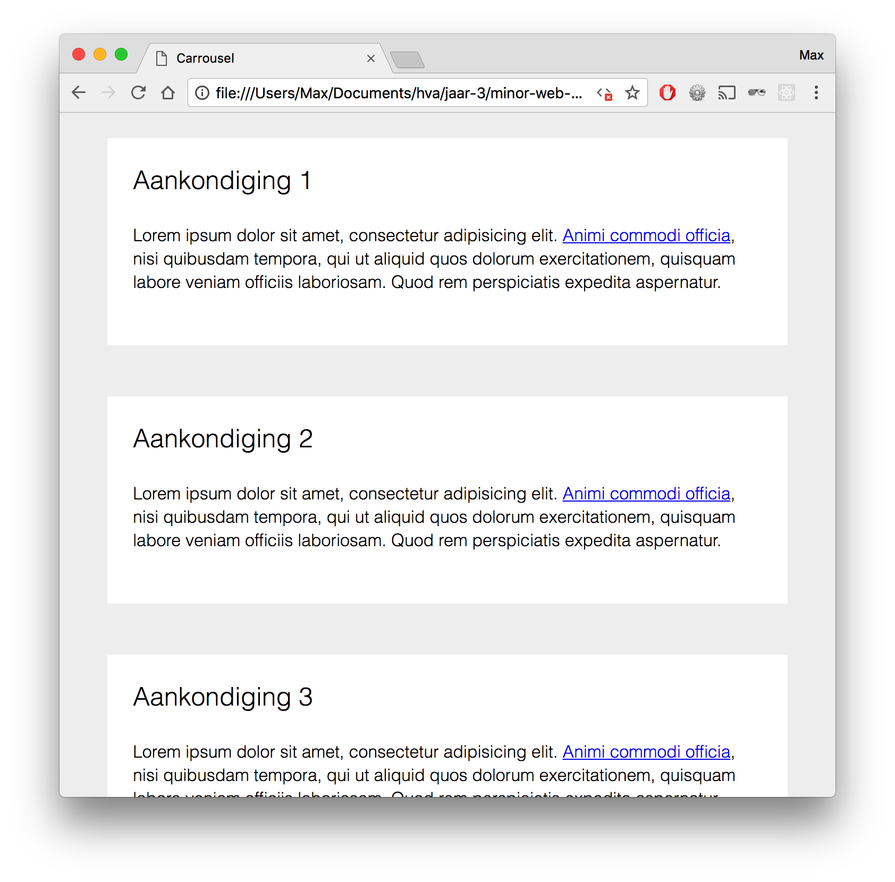
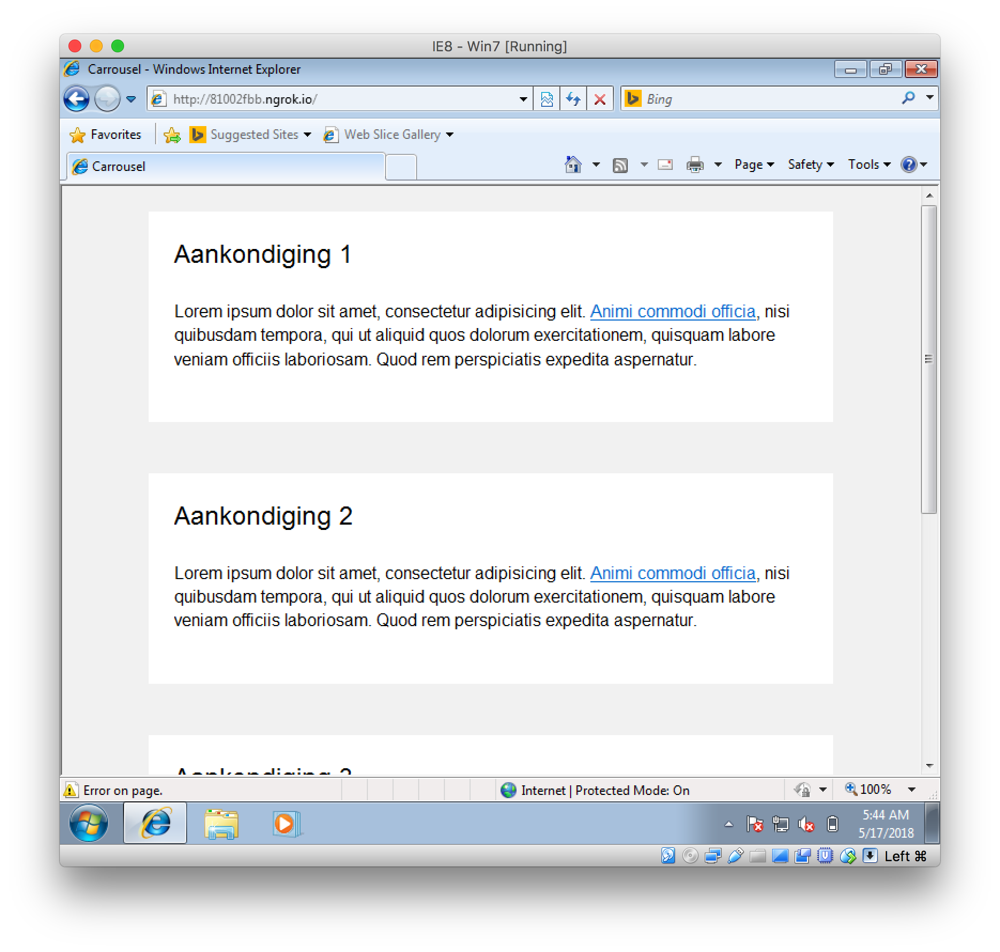

# Carrousel



[Demo](https://vriesm060.github.io/browser-technologies/opdracht2/carrousel/)

Een carrousel, via Progressive Enhancement opgebouwt.

## Feedback

| Feedback | Verbetering |
| -------- | ----------- |
| Test IE8 | Done |
| README toevoegen | |
| Test toevoegen | |

## Core functionaliteit

De core functionaliteit van een carrousel is om informatie horizontaal in delen aan de bezoeker weer te geven. De bezoeker moet zelf door de verschillende slides heen kunnen navigeren.

De HTML structuur van deze carrousel bestaat uit een unordered list waarbij elke list item een slide van de carrousel is.

```
<section class="carrousel">
  <ul class="carrousel--container">
    <li>
      <article>
        <h2>Aankondiging 1</h2>
        <p></p>
      </article>
    </li>
    <li>
      <article>
        <h2>Aankondiging 2</h2>
        <p></p>
      </article>
    </li>
  </ul>
</section>
```

Met Javascript wordt de functionaliteit van de carrousel gemaakt. De container, waar alle slides in zitten, wordt bij elke nieuwe slide naar links verplaatst, aan de hand van een `idx` variabele.

```
start: function (idx) {
  this.container().style.left = (idx * -100) + '%';
}
```

Deze `idx` variabele wordt veranderd aan de hand van welke slide getoond moet worden. Standaard is de waarde `0`. Wanneer er op de 'volgende' knop geklikt wordt, wordt de idx `idx++`. Wanneer er op de 'vorige' knop geklinkt wordt, wordt de idx `idx--` en om de 5 seconden gaat de carrousel naar de volgende slide.

```
setInterval(function () {
  if (idx === self.slide().length - 1) {
    idx = 0;
  } else {
    idx++;
  }
  self.start(idx);
}, 5000);
```

Wanneer er geen `document.addEventListener` ondersteund wordt valt de functionaliteit van de carrousel weg en worden de slides onder elkaar getoond als een lijst. Dit gebeurt ook wanneer er helemaal geen Javascript is.



*De carrousel zonder Javascript wordt een lijst*

## Browser ondersteuning

### HTML5 Elementen
---

 |  |  |  | 
--- | --- | --- | --- | --- |
4+ | 3+ | 9+ | 10.1+ | 3.1+

Bij IE 6-8 moeten de HTML5 elementen aangemaakt worden in een script in de `<head>`:

```
<script type="text/javascript">
  document.createElement('section');
  document.createElement('article');
</script>
```

### document.querySelector
---

 |  |  |  | 
--- | --- | --- | --- | --- |
4+ | 3.5+ | 8+ | 10.1+ | 3.1+

Wanneer een browser geen `document.querySelector` of `document.querySelectorAll` ondersteundt, valt hij terug op basis Javascript om het gewenste element te pakken.

```
function () {
  if (document.querySelector('.carrousel--container') !== undefined) {
    return document.querySelector('.carrousel--container');
  } else {
    var all = document.getElementsByTagName('*');
    for (var i = 0; i < all.length; i++) {
      if (all[i].className.indexOf('carrousel--container') !== -1) {
        return all[i];
      }
    }
  }
}
```

### document.addEventListener
---

 |  |  |  | 
--- | --- | --- | --- | --- |
4+ | 2+ | 9+ | 10.1+ | 3.1+

Wanneer de browser dit niet ondersteundt, valt hij terug op een lijst van alle slides.

```
if (document.addEventListener) {
  this.prevBtn().className += ' show';
  this.nextBtn().className += ' show';
  ...
} else {
  this.container().className = '';
}
```



*Onder andere op IE8 valt de carrousel terug tot een lijst*
