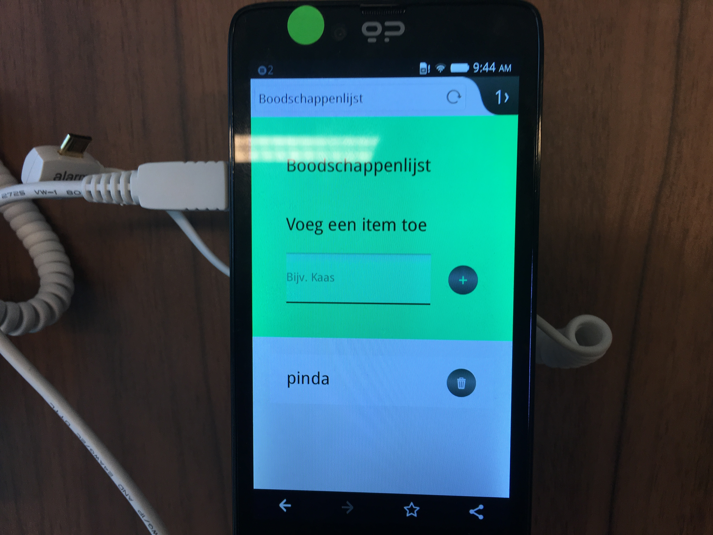

# Boodschappenlijst App :pizza:

  

Met deze app kan je een boodschappenlijst aanmaken door producten in te voeren via het invoerveld. Producten kunnen later ook weer verwijderd worden. De boodschappenlijst blijft bewaard wanneer de browser afgesloten is.

## Frameworks en Node packages

Dit project is gebouwd met behulp van de volgende frameworks en Node packages:

* [Express JS](https://expressjs.com/)
* [EJS](http://ejs.co/)
* [Request](https://github.com/request/request)
* [Body parser](https://www.npmjs.com/package/body-parser)

## Installeren

Om deze app lokaal te installeren, moet je eerst `git clone` uitvoeren op de browser-technologies repository. Daarna voer je `npm install` en `npm build` uit via jouw terminal. Met `npm start` kan de app gedraaid worden op je localhost.

## Features

* [x] Producten toevoegen
* [x] Producten verwijderen
* [x] Boodschappenlijst blijft bewaard bij afsluiten browser
* [x] Werkt zonder Javascript
* [x] Producten verwijderen met Drag en Drop
* [ ] Dubbele producten worden opgeteld
* [ ] Producten in categorieën opdelen
* [ ] Offline werkbaar

## Gebruik

#### Core functionaliteit
---
De core functionaliteit is server side opgebouwd. Extra features zijn client side gemaakt. Deze hebben feature detection en fallback voor browsers die de nieuwe features niet ondersteunen.

De core functionaliteit bestaat uit een `<input>` veld en een submit `<button>` die een POST request naar de homepage doet en de ingevoerde waarde in een `<li>` zet. Zo wordt een product in de boodschappenlijst gestopt. Nieuwe producten worden aan het begin van de lijst gezet.

```
<header class="add-item">
  <h1>Boodschappenlijst</h1>
  <form action="/" method="post">
    <label for="list-item">Voeg een item toe</label>
    <div>
      <input id="list-item" type="text" name="listItem" value="Kaas" autocomplete="off" autofocus>
      <button type="submit" name="submitList" aria-label="Voeg item toe">+</button>
    </div>
  </form>
</header>
```
*Core functionaliteit in de HTML*

```
.post('/', function (req, res) {
	var listItem = req.body.listItem;

	if (/([a-zA-Z0-9])/.test(listItem)) {
		var item = {
			id: new Date().getTime(),
			item: listItem
		};
		storage.unshift(item);
	}
	res.redirect('/');
});
```
*POST request om een nieuw product aan de boodschappenlijst toe te voegen*

Elk item in de boodschappenlijst kan ook verwijdert worden. Bij het klikken op de verwijder knop wordt een nieuwe POST request gestuurd die het item weer uit de lijst verwijdert.

```
app.post('/delete', function (req, res) {
	var id = Number(req.body.delete);
	storage.forEach(function (item, i, self) {
		if (item.id === id) {
			self.splice(i, 1);
		}
	});
	res.redirect('/');
});
```
*POST request om een product te verwijderen uit de boodschappenlijst*

#### Drag en Drop
---

  

Als enhancement heeft de app een Drag en Drop functionaliteit. Wanneer dit wordt ondersteund, kan je via Drag en Drop producten uit de lijst verwijderen, naast de standaard manier.

```
if (('draggable' in document.createElement('li')) && document.addEventListener) {
  var self = this;
  this.createDropzone();
}
```
*Wanneer een browser het `draggable` attribuut ondersteund, wordt de Drag en Drop functionaliteit als enhancement toegevoegd*

#### Accessibility :see_no_evil: :hear_no_evil: :speak_no_evil:
---

Om de accessibility te testen heb ik [Funkify](http://www.funkify.org/) gebruikt en de standaard Voice Over van Mac. Ook heb ik een audit gedaan met de Chrome Dev Tools die 100% accessibility terug gaf. De app werkt ook met gebruik van toetsenbord.

  
*Resultaten van de Audit*

  
*Accessibility resultaten van de Audit*

## Browser ondersteuning

Drag & Drop wordt door maar 50% van de browsers ondersteund, maar de core functionaliteit wordt door bijna alle browsers ondersteund. Alleen op browsers die geen HTML5 elementen ondersteunen, IE6, IE7, IE8 en Firefox 2, ziet de app er minder goed uit. Dit komt doordat het grootste gedeelte van de styling dan niet gevonden wordt. Ondanks dit is de belangrijkste informatie nog wel beschikbaar.


*De app op IE8*

#### Testen bij het Device lab
---


Een van de dingen die uit de test bij het Device Lab naar voren kwam, was dat op één van de devices het `input` veld een standaard achtergrond mee kreeg, die van de browser afkomstig was. Nadat ik in de CSS `background-color: transparent;` aan de `input` had toegevoegd, verdween deze standaard stijl weer. 

| **Before:** | **After:** |
|-------------|------------|
|  |  |
